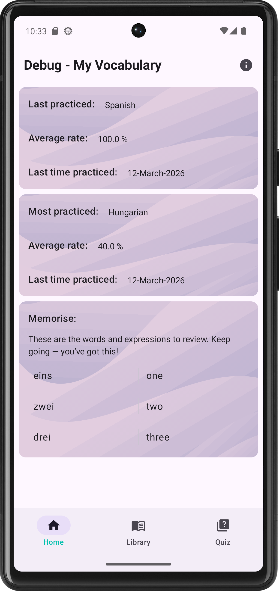
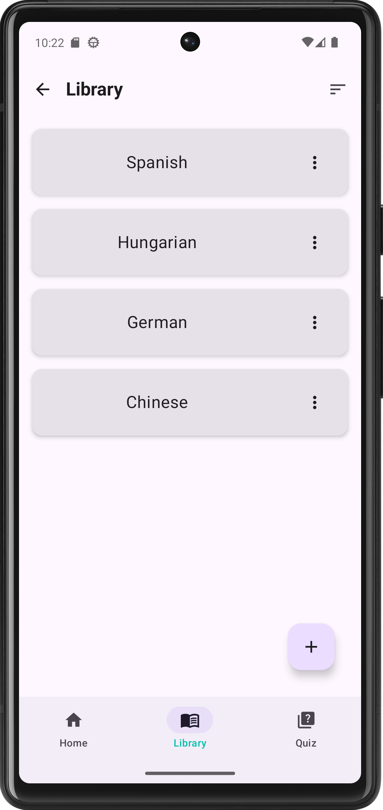
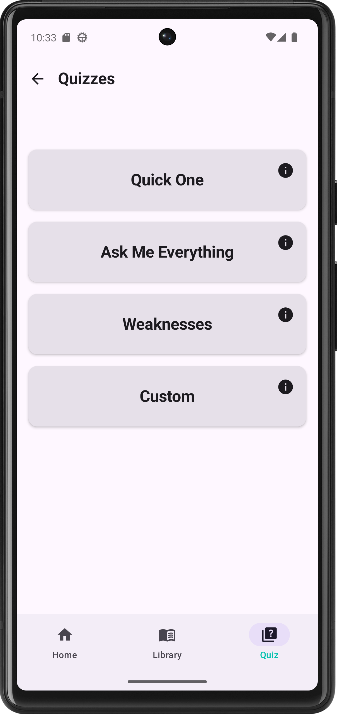
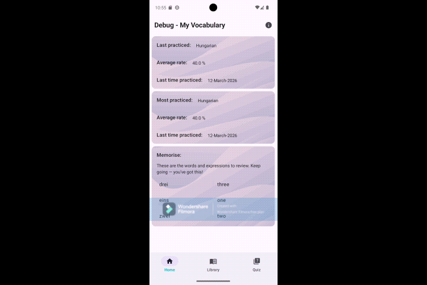

# My Vocabulary

The purpose of this application is to provide a robust platform for language learners to manage
their own dictionaries and practice vocabulary through various quiz types. This project serves as a
comprehensive showcase of modern Android development, evolving from a legacy View-based architecture
to a modern, reactive, and declarative stack.

## 📸 Screenshots

|                  Home Screen                   |                Dictionary List                 |                   Quiz Mode                    |
|:----------------------------------------------:|:----------------------------------------------:|:----------------------------------------------:|
|  |  |  |

  
 
  <i>Featuring smooth Lottie animations for quiz transitions and empty states.</i>

## 🚀 Recent Updates (Last 6 Months)

I have significantly modernized the codebase and added features to improve the user experience:

- **Jetpack Compose Migration:** Fully transitioned the UI from XML Layouts to a declarative UI
  using Jetpack Compose, including the use of Material 3 Expressive APIs for a modern look and feel.
- **Type-Safe Navigation:** Implemented the new Jetpack Navigation 2.8.x with Type-Safe Routes,
  eliminating string-based navigation errors.
- **Advanced Statistics:** Enhanced the Room database schema to track "Last Practiced" dates, "
  Average Success Rates," and "Total Quiz Counts" per dictionary.
- **Lifecycle-Aware UI:** Integrated `LifecycleEventEffect` to ensure statistics and word lists
  refresh automatically whenever the user lands on the Home screen.
- **File Interoperability:** Implemented CSV Import (using Activity Result API) and CSV Export (via
  FileProvider and Share Intents) to allow users to move their data freely.
- **Modernized Testing:** Migrated unit tests to **MockK** and implemented **Room Migration Tests**
  with schema exporting to ensure 100% data safety during database updates.
- **Lottie Animations:** Integrated Airbnb's Lottie library to provide delightful, high-performance
  vector animations for quiz feedback, loading states, and empty placeholders.

## 🛠 Tech Stack

- **Language:** Kotlin (100%)
- **UI:** Jetpack Compose with Material 3
- **Architecture:** MVVM (Model-View-ViewModel) + Repository Pattern
- **Database:** Room (with multi-version migrations and automated schema exports)
- **Reactive Programming:** RxJava 2 (Data streams) & Kotlin Coroutines/Flow (UI State)
- **Dependency Injection:** Koin
- **Navigation:** Jetpack Navigation (Type-Safe)
- **Testing:** JUnit 4, MockK, Room-Testing
- **CI/CD:** GitHub Actions
- **Animations:** Lottie for Android (Compose-native implementation)

## 📈 Key Features

- **Dictionary Management:** Create, import, and export custom dictionaries.
- **Multiple Quiz Types:** Practice with "Full Quiz," "Quick Quiz" (random selection), or "Weakest
  Words" (focusing on low-success items).
- **Practice History:** Visual feedback on the Home screen showing recently practiced dictionaries
  and overall progress.
- **Search & Sort:** Efficiently manage large word lists with real-time filtering and multiple
  sorting options.

## 🏗 Setup & Development

The project uses the official Room Gradle Plugin for schema management. To run migration tests,
ensure the `schemas` folder is populated by running a full build.
